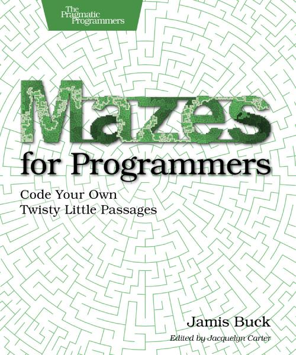

# Mazes for Programmers - TypeScript 🚧
Code Your Own Twisty Little Passages

## Java Implementation

In the book *[Mazes for Programmers](https://pragprog.com/titles/jbmaze/mazes-for-programmers/)* a Ruby implementation is given, but it can be implemented in many different programming languages.

The idea for this repository to make a TypeScript implementation.
Check the [progress](progress.md).

Looking for another implementation? Check out these other [projects on GitHub](https://github.com/search?q=mazes+for+programmers)!
